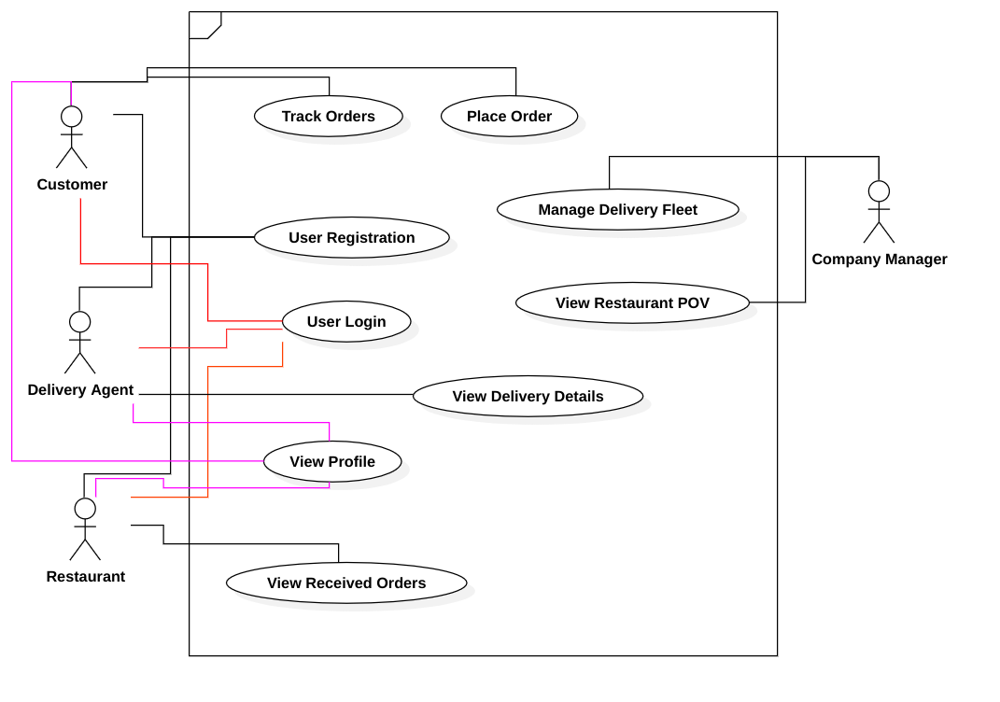

# Software Requirements Specification Document

### Arnav Sharma
### 2023111033

## Assignment 2 Question 1

## Brief Problem Statement
To design an online food delivery system. The system should allow customers to place orders in restaurants online either for takeaway or home delivery, providing real-time order tracking. The admin should be able to view a restaurant POV. The system must maintain a persistent instance across multiple terminals.

## System Requirements
- Python 3.8 or higher
- OS- Windows, Linux or MacOS
- SQLite

## Users Profile
**Assumption**-> All users will have basic knowledge of how to use computers.  
The system will be used by-
- **Customers**-> The end-users who will be placing the orders. 

- **Restaurants**->The restaurants should be able to view orders placed to them and their details, along with who is coming to pick the order up.

- **Company Manager**-> The company manager should be able to view the workings of a restaurant on the app.

- **Delivery Agents**->Should be able to see details of their next order delivery on the app.Total earnings should be visible as well.

## Feature Requirements

| S.No. | Use Case Name          | Description                                                   |
|-------|-----------------------|--------------------------------------------------------------|
| 1.    | User Registration     | Customers, Delivery Agents, and Restaurants should be able to register themselves in the app. |
| 2.    | User Login           | All users and the company manager should be able to login into their accounts on the app. |
| 3.    | View Profile        | Customers, Delivery Agents, and Restaurants should be able to view their profiles. |
| 4.    | Place Order         | Customers should be able to browse available options and place orders. |
| 5.    | Track Orders        | The customer should be able to track all placed orders. |
| 6.    | Manage Delivery Fleet | The company manager should be able to view information regarding the delivery fleet’s numbers and statuses. |
| 7.    | View Received Orders | The restaurant should be able to view all orders placed to them. |
| 8.    | View Delivery Details | The delivery agent should be able to view the details of their delivery assignments. |
| 9.    | View Restaurant POV  | The company managers should be able to view the restaurant's perspective. |

## Use Case Diagram

## Use Case Description
| Use Case Number | UC-01                                      |
|----------------|---------------------------------------------|
| Use Case Name  | User Registration                           |
| Overview       | Allows new Customers, Delivery Agents, and Restaurants to register by providing necessary details for creating new accounts in the app. |
| Actors        | Customer, Delivery Agent, Restaurant         |
| Pre-condition | The app is running. The user is not already registered. |
| Flow          | 1. The User selects the registration option (Customer, Delivery Agent, or Restaurant).   2. Entering details:   2.1. If the user is a customer, they enter their name, phone number, address and password.   2.2. If the user is a delivery agent, they enter their name, phone number, vehicle registration number and password.   2.3. If a restaurant, they enter the name, phone number, two menu items with price and preparation+delivery time; and password.   3. Inputs are validated by the system.   4. Details are stored in the database.   5. Message stating successful registration is printed. |
| Alternate Flow | 3. User enters invalid details - incorrect format or details of pre-existing account.   3.1. Returns to main flow at step 1.   4. Error in storing details in database.  4.1. Returns to main flow at step 1. |
| Post Condition | The user account is created and stored in the database, ready for login. |

  

| Use Case Number | UC-02                                       |
|----------------|----------------------------------------------|
| Use Case Name  | User Login                                   |
| Overview       | Allows registered Customers, Delivery Agents, Restaurants, and the Company Manager to login to the app using their credentials. |
| Actors        | Customer, Delivery Agent, Restaurant, Company Manager |
| Pre-condition | The user must be registered in the app.       |
| Flow          | 1. The User selects the login option.   2. The user enters the account phone number and password when prompted by the system.   3. The system validates the credentials.   4. If credentials are validated, the user is granted access to use the rest of the features of the app. |
| Alternate Flow | 3. The user enters invalid details.   3.1. Returns to the main flow at step 2. |
| Post Condition | User is logged in to the system and can use the features of the app, visible on a dashboard. |

  
| Use Case Number | UC-03                                       |
|----------------|----------------------------------------------|
| Use Case Name  | View Profile                                 |
| Overview       | Allows registered Customers, Delivery Agents, and Restaurants to see their profile data upon logging into the app. |
| Actors        | Customer, Delivery Agent, Restaurant          |
| Pre-condition | The user must be logged into the app.         |
| Flow          | 1. The user selects the view profile option from the dashboard.   2. The system fetches the user’s details from the database.   3. User details are visible to the user. |
| Alternate Flow | 2. There is an error in fetching details from the database.   2.1. Error message is displayed.   2.2. Returns to the main menu/dashboard. |
| Post Condition | User’s details are displayed successfully.    |
  

| Use Case Number | UC-04                                      |
|----------------|---------------------------------------------|
| Use Case Name  | Place Order                                 |
| Overview       | Allows logged-in Customers to place food orders from the restaurant of their choice. |
| Actors        | Customer                                     |
| Pre-condition | The user must be logged into the app.   There must be restaurants with menu items registered on the app. |
| Flow          | 1. Customer selects the Place Order option from the Dashboard.   2. The system displays the available restaurant options.   3. The customer selects a restaurant.   4. The system displays the menu of the selected restaurant.   5. The customer selects the items and quantity for each item.   6. The customer chooses the option to add more items or checkout.   7. The customer chooses delivery type - takeaway or home-delivery.   8. The system calculates the total price.   9. The customer confirms the order.   10. The system stores the order details in the database and assigns it an order_ID.   11. The customer receives the order_ID. |
| Alternate Flow | 3. If no restaurants are available, an error message is shown, and the user returns to the main dashboard.   8. If there are no added items, the system displays an error message and returns to the main flow at step 3. |
| Post Condition | Order is successfully placed.               |

  
| Use Case Number | UC-05                                       |
|----------------|----------------------------------------------|
| Use Case Name  | Track Orders                                 |
| Overview       | Allows logged-in Customers to view the current status of their placed orders along with the estimated time of delivery. |
| Actors        | Customer                                      |
| Pre-condition | The user must be logged into the app.         |
| Flow          | 1. The customer selects the Track Orders option from the dashboard.   2. The system displays a list of active orders along with their order_IDs.   3. The customer selects an order to track by entering its order_ID.   4. The system displays the order details along with the remaining time till delivery (for delivery orders) or ready time (for takeaway orders). |
| Alternate Flow | 3. The customer does not have any active orders.   3.1. Returns to the main menu dashboard.   2, 4. If there is any error while fetching the order list or order status, an error message is displayed and the system returns to the main flow at step 2.  5. If no delivery agent is available yet, it shows “Agent not yet assigned. Kindly bear with us.”|
| Post Condition | Order status is displayed.                   |

  
| **Use Case Number** | UC-06                                     |
|--------------------|--------------------------------------------|
| **Use Case Name**   | Manage Delivery Fleet                     |
| **Overview**        | Allows the Company Manager to view information about the delivery fleet, including the total number of delivery agents and their current availability status. |
| **Actors**          | Company Manager                           |
| **Pre-condition**    | - The Company Manager should be logged into the system.   - Delivery Agents must be registered. |
| **Flow**            | 1. The Company Manager selects the **Manage Delivery Fleet** option.   2. The system fetches delivery agents' information from the database.   3. The system displays the **total number of delivery agents** along with their **statuses** (**Available** or **On Delivery**). |
| **Alternate Flow**   | 2.1. If no delivery agents are registered in the app, the system displays a message: **“No delivery agents available”** and redirects to the main dashboard.   2.2. If an error occurs while fetching data, an error message is shown, and the system returns to the main flow at step 1. |
| **Post Condition**   | The Company Manager is shown the delivery fleet information, including the number of **available** and **unavailable agents**. |
  

| **Use Case Number** | UC-07                                     |
|--------------------|--------------------------------------------|
| **Use Case Name**   | View Received Orders                      |
| **Overview**        | Allows restaurants to view the list of orders placed by customers on the app, along with their details. |
| **Actors**          | Restaurants                               |
| **Pre-condition**    | - The restaurant must be logged into the system. |
| **Flow**            | 1. The restaurant selects **View Received Orders** from the dashboard.   2. The system fetches the list of active orders given to the restaurant from the database.   3. The orders and their details are displayed. |
| **Alternate Flow**   | 2.1 If there are no available orders, the system shows the message “No orders received” and returns to the main menu.   2.2 If an error occurs while fetching the data, an error message is shown, and the system returns to the main flow at step 1. |
| **Post Condition**   | The restaurant is shown the list of their received orders. |
  

| **Use Case Number** | UC-08                                    |
|--------------------|--------------------------------------------|
| **Use Case Name**   | View Delivery Details                    |
| **Overview**        | Allows delivery agents to view details of their assigned deliveries, including order information and total earnings. |
| **Actors**          | Delivery Agent                            |
| **Pre-condition**    | - The delivery agent must be logged into the system. |
| **Flow**            | 1. The delivery agent selects the **View Delivery Details** option in the main menu.   2. The system fetches the assigned deliveries for that day from the database.   3. Delivery details — including **order_ID**, **customer name**, **address**, **price**, and **earnings** — are shown.   4. The **total earnings** of the delivery agent on that day are shown. |
| **Alternate Flow**   | 2.1 If no deliveries have been assigned to the delivery agent, the system displays “No deliveries assigned” and returns to the main menu.   2.2 If there is an error fetching the details from the database, an error message is shown, and the system returns to the main flow at step 1. |
| **Post Condition**   | The delivery agent is shown their assigned delivery details. |
  

| **Use Case Number** | UC-09                                    |
|--------------------|--------------------------------------------|
| **Use Case Name**   | View Restaurant POV                      |
| **Overview**        | Allows the Company Manager to view restaurant operations, including active orders, restaurant details, past completed orders, and order statuses. |
| **Actors**          | Company Manager                           |
| **Pre-condition**    |  The Company Manager must be logged into the system. |
| **Flow**            | 1. The Company Manager selects the **View Restaurant POV** option.   2. The system fetches the restaurant information from the database.   3. The list of **registered restaurants** is displayed.   4. The Company Manager selects a restaurant from the list.   5. The system displays restaurant details, including **name**, **menu items**, **active orders**, **past completed orders**, and **order statuses**. |
| **Alternate Flow**   | 4.1 If no restaurants are registered, the system displays “No Registered Restaurants” and redirects to the main menu.   5.1 If the selected restaurant has no active or past orders, the system displays “No orders found” along with restaurant details.   5.2 If an error occurs while fetching data, an error message is shown, and the user is redirected to step 1. |
| **Post Condition**   | The Company Manager is shown the selected restaurant's details. |

  

# Assumptions made
<li>It is for certain that a food item will get prepared in the said time.
<li>Delivery time of an order does not depend on the location of the customer relative to the restaurant.
<li>Delivery agents get payed the same amount of money no matter the delivery distance.
